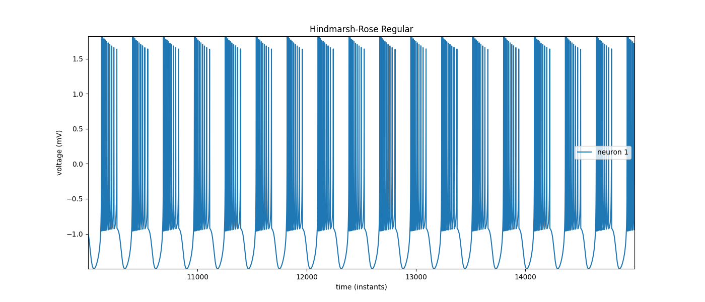
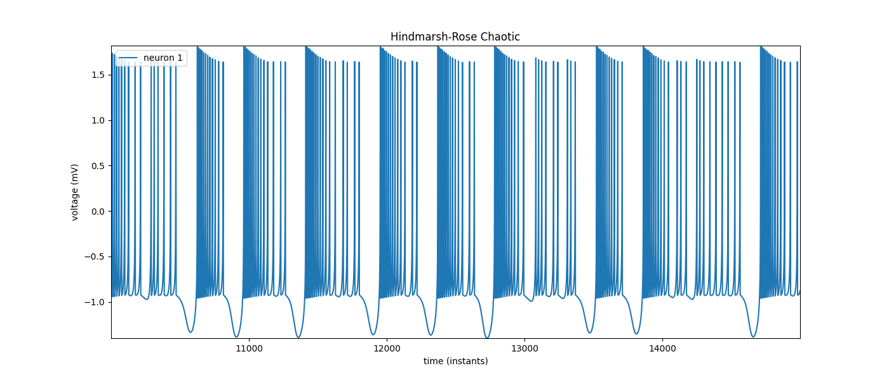
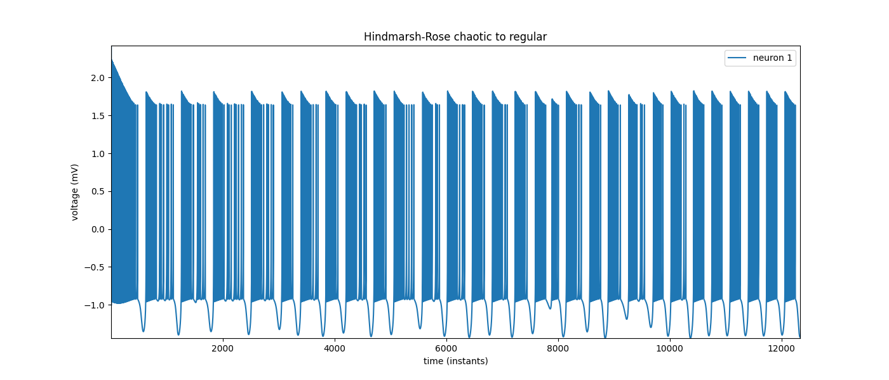
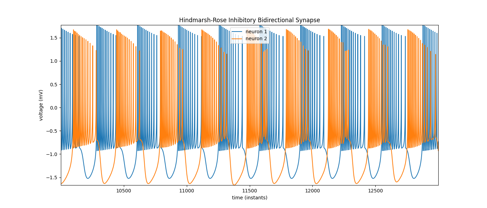

# Second Assignment

> Sergio Hidalgo - sergio.hidalgo@estudiante.uam.es
>
> Alvaro Simon - alvaro.simond@estudiante.uam.es

## Hindmarsh-Rose model, the `e` parameter

This set of differential equations is a neural model with different parameters that allow to change its behaviour. In this scope, it is important to mention the `e` parameter, which is used to change the regime of the model from regular ([Figure 1.A](#figure-1-a)) to chaotic ([Figure 1.B](#figure-1-b)). The value selected for the regular simulation is $e = 3.0$ and for the chaotic one is $e = 3.281$. 

<table>
  <tr>
    <td id="figure-1-a" align="center">
      
      <br>
      <em>Figure 1.A: Hindmarsh-Rose model in regular regime, with `e` being 3.0</em>
    </td>
    <td id="figure-1-b" align="center">
      
      <br>
      <em>Figure 1.B: Hindmarsh-Rose model in chaotic regime, with `e` being 3.281</em>
    </td>
  </tr>
</table>

For executing this simulations, you can run this commands:

```bash
cargo run --release -p hindmarsh-rose-rs --  --downsample-rate 50 --goal 20000 --runge-kutta --filename hindmarsh-rose-regular.csv analysis  
cargo run --release -p hindmarsh-rose-rs -- --e 3.281 --downsample-rate 50 --goal 20000 --runge-kutta --filename hindmarsh-rose-chaotic.csv analysis
```

Both executions will be stored under `data/` directory inside the specified directory.

## Analyzing the chaotic regime

Because of the nature of `e` parameter, one question rises, What is the maximum value for `e` that we can assign preserving the regular regime. In other words, what is the asymptotic value that separates the chaotic regime to the regular one for `e`? The value calculated is $e = 3.221$ and for achieving this, two methods can be used. The first one, is giving values to `e` from $3.0$ to the limit value, observing if the uniform pattern is present. The other one is using the standard deviation of the ISIs (Inter Spikes Intervals) duration, assigning a tolerance that when reached, will stop the script (this one is preferred) ([Figure 2](#figure-2)). 

<table>
  <tr>
    <td id="figure-2" align="center">
      
      <br>
      <em>Figure 2: Hindmarsh-Rose model from chaotic to regular</em>
    </td>
  </tr>
</table>

For executing this simulation, you can run this commands (You will need to run each one in a terminal):

In one terminal the model:
```bash
cargo run --release -p hindmarsh-rose-rs -- --e 3.281 --downsample-rate 50 --eternal-loop --write-on-pipe --runge-kutta analysis  
```

In other one the analyzer, as stated previously, you can execute by setting a maximum value for `e` or using the standard deviation tolerance as stopping parameter:
```bash
# With max e
cargo run --release -p hindmarsh-rose-analyzer-rs  -- --max-e 3.26
# With std tolerance
cargo run --release -p hindmarsh-rose-analyzer-rs  -- --stop-with-standard-deviation -sdt 10
```

The execution will be stored in `data/hindmarsh-rose-analysis.csv`, there is also a file that stores the standard deviations (`data/hindmarsh-rose-analysis-stds.csv`) and another that keeps the times of the spike of the first depolarization and the last repolarization (`data/hindmarsh-rose-analysis-intrabursts.csv`).

## Closed loop of a neural circuit

This bidirectional synapse connection synchronizes two Hindmarsh-Rose models with chaotic activity. The synaptic models used for this interaction are a both chemical and inhibitory, one fast and the other slow. The interaction shows that both synapses, despite being in a chaotic regime, regularize their activity to synchronize themselves in antiphase ([Figure 3](#figure-3)). Nevertheless, it shows overlap in some spikes due to some loss of synchronization that gets corrected with the evolution of the interaction (because of the synapses)-

<table>
  <tr>
    <td id="figure-3" align="center">
      
      <br>
      <em>Figure 3: Two Hindmarsh-Rose models connected via two chemical and inhibitory synapse models</em>
    </td>
  </tr>
</table>

For executing this simulation, it is only recommended to execute the main program, because it requires a lot of pipes and it can cause some desynchronizing since they introduce some latency to the interaction. For this, execute:

```bash
cargo run --release
```

The execution will be stored in `data/hindmarsh-rose-bidirectional-in-chem-syn.csv`, bear in mind that the neurons names on the header are *x_pos* and *x_pre* for differencing purposes, but both neurons are presynaptic and postsynaptic (depending of the synapse connection).

